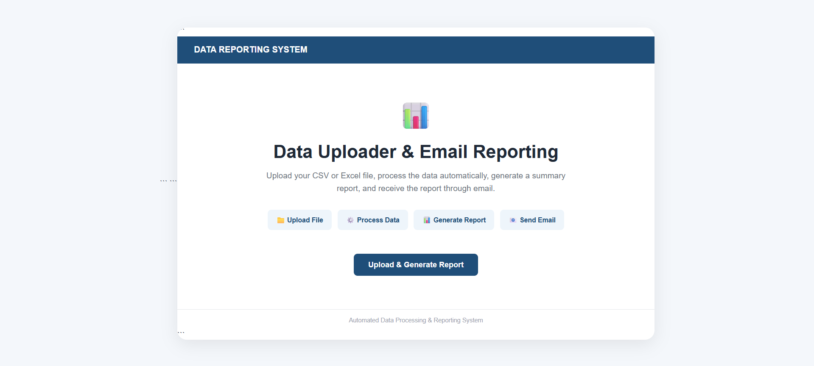
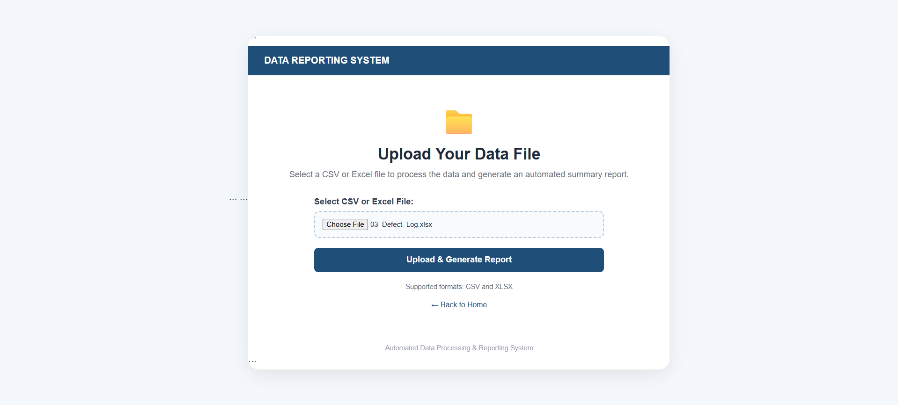
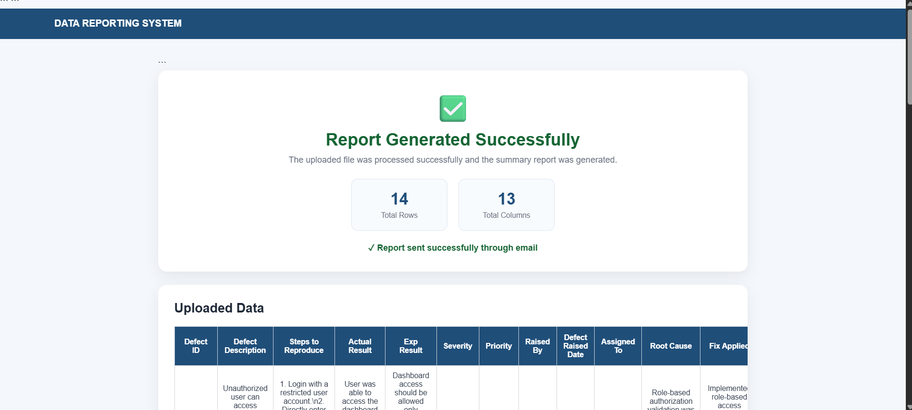
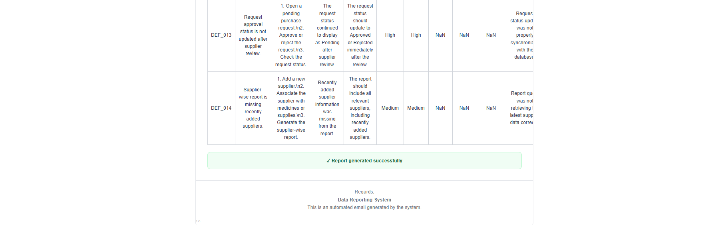

# Data Uploader with Email Reporting

A Django-based web application that allows users to upload CSV or Excel files, process the data using Pandas, generate a summary report, display the processed data in a professional web interface, and send the report through email.

## Project Overview

The **Data Uploader with Email Reporting** system automates the process of uploading and analyzing structured data files.

Instead of manually opening and analyzing CSV or Excel files, the user can upload the file through a web interface. The application processes the uploaded data and provides:

* Number of rows
* Number of columns
* Processed data in tabular format
* Email-based summary report

The application is designed with a simple and user-friendly interface for easy data processing and reporting.

## Key Features

* Upload CSV files
* Upload Excel `.xlsx` files
* Validate supported file formats
* Process uploaded files using Pandas
* Generate an automatic data summary
* Display processed data in a web page
* Generate an HTML email report
* Send the report through Gmail SMTP
* Professional and responsive user interface
* Secure email configuration using environment variables
* Production deployment support using Gunicorn and WhiteNoise

## Application Workflow

```text
User
  ↓
Upload CSV / Excel File
  ↓
Django File Upload Form
  ↓
Pandas Data Processing
  ↓
Generate Summary
  ↓
Create HTML Report
  ↓
Display Report on Web Page
  ↓
Send Email Report
```

## Application Screenshots

### 1. Home Page

The home page provides an overview of the Data Reporting System and guides the user through the complete workflow.



---

### 2. File Upload

Users can upload CSV or Excel files for processing.



---

### 3. Generated Report

After processing the file, the application displays the total number of rows, columns, and the uploaded data in a structured table.



---

### 4. Email Report

The system automatically sends the generated summary report through email in a professional HTML format.



## Technology Stack

| Technology | Purpose                       |
| ---------- | ----------------------------- |
| Python     | Application development       |
| Django     | Web application framework     |
| Pandas     | Data processing and analysis  |
| OpenPyXL   | Excel file processing         |
| HTML/CSS   | User interface                |
| Gmail SMTP | Email delivery                |
| Gunicorn   | Production application server |
| WhiteNoise | Static file serving           |
| SQLite     | Django default database       |

## Project Structure

```text
Data-Uploader-with-Email-reporting/
│
├── DevTest/
│   ├── settings.py
│   ├── urls.py
│   └── wsgi.py
│
├── app/
│   ├── migrations/
│   ├── templates/
│   │   └── app/
│   │       ├── home.html
│   │       ├── upload.html
│   │       ├── success.html
│   │       └── email.html
│   ├── forms.py
│   ├── models.py
│   ├── urls.py
│   └── views.py
│
├── media/
├── manage.py
├── requirements.txt
├── build.sh
├── .gitignore
└── README.md
```

## Supported File Formats

The application currently supports:

* `.csv`
* `.xlsx`

Other file formats are rejected by the application.

## Report Generation

After a file is uploaded, Pandas reads the data and creates a summary containing:

* Total number of rows
* Total number of columns
* Complete uploaded dataset in tabular format

The report is displayed on the success page and is also prepared as an HTML email.

## Email Reporting

The application uses Gmail SMTP to send the generated report.

The email contains:

* Report title
* Row count
* Column count
* Uploaded data table
* Automated report footer

The email subject is:

```text
Data Processing & Summary Report
```

## Environment Variables

Email credentials and other sensitive configuration values are not stored directly in the source code.

The application uses the following environment variables:

```text
SECRET_KEY
DEBUG
EMAIL_HOST_USER
EMAIL_HOST_PASSWORD
REPORT_RECEIVER_EMAIL
```

For example:

```text
SECRET_KEY=your-secret-key
DEBUG=False
EMAIL_HOST_USER=your-email@gmail.com
EMAIL_HOST_PASSWORD=your-gmail-app-password
REPORT_RECEIVER_EMAIL=receiver-email@gmail.com
```

> Never commit your Gmail password or Gmail App Password to the Git repository.

## Local Setup

### 1. Clone the repository

```bash
git clone https://github.com/Srivalli13204/Data-Uploader-with-Email-reporting.git
```

### 2. Navigate to the project

```bash
cd Data-Uploader-with-Email-reporting
```

### 3. Create a virtual environment

Windows:

```bash
python -m venv venv
```

Activate it:

```bash
venv\Scripts\activate
```

### 4. Install dependencies

```bash
pip install -r requirements.txt
```

### 5. Configure environment variables

Set the required environment variables before running the application.

### 6. Run Django checks

```bash
python manage.py check
```

### 7. Apply migrations

```bash
python manage.py migrate
```

### 8. Run the application

```bash
python manage.py runserver
```

Open the application in a browser:

```text
http://127.0.0.1:8000/
```

## Production Deployment

The application is configured for deployment using:

* Gunicorn
* WhiteNoise
* Environment variables
* Django production settings

The application can be deployed to a cloud hosting platform that supports Django web services.

The production start command is:

```bash
gunicorn DevTest.wsgi:application
```

## Security

Sensitive information such as:

* Gmail App Password
* Secret key
* Email configuration

should be stored as environment variables rather than committed to GitHub.

The `.gitignore` file prevents local environment files and sensitive development files from being committed.

## Future Enhancements

Possible future improvements include:

* User authentication
* File size validation
* Advanced data analysis
* Charts and visualizations
* Multiple email recipients
* Downloadable reports
* Background email processing
* Persistent report history
* Database-backed report management
* Improved error handling and logging

## Author

**Srivalli**

### Project

**Data Uploader with Email Reporting**